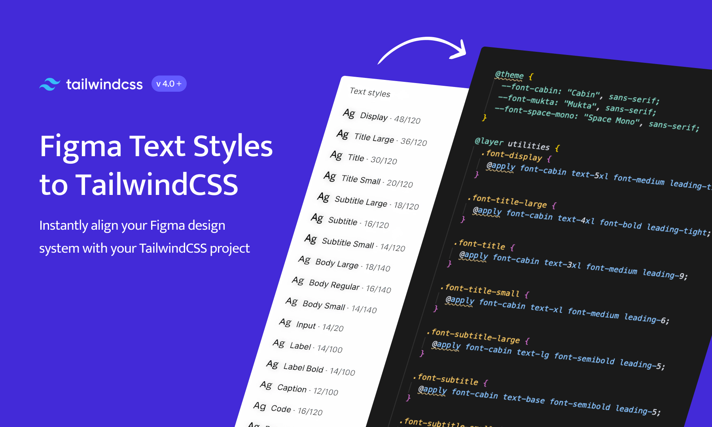
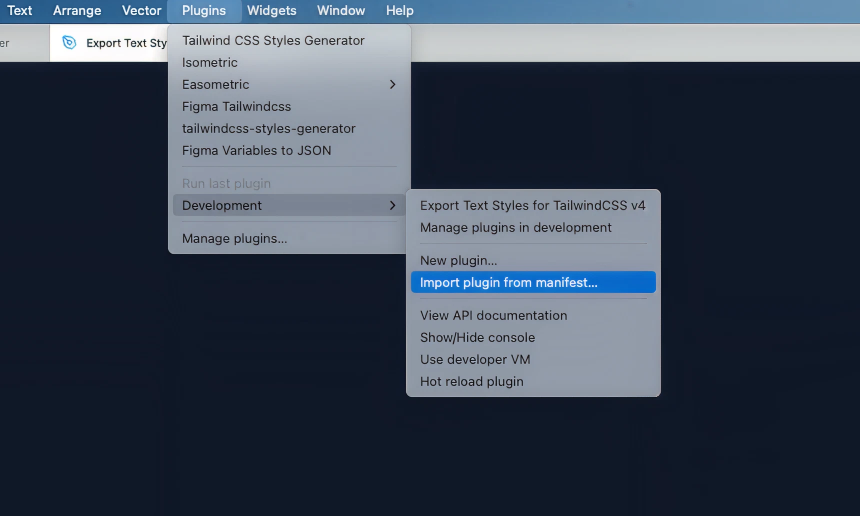

# Export Text Styles for TailwindCSS v4
Export complete Figma text styles to TailwindCSS v4 with all properties including line-height, letter-spacing, and paragraph spacing.




## Installation

### Figma Community (In Review)
Use [Export Text Styles for TailwindCSS v4](https://www.figma.com/community/plugin/1531407977615884339/export-text-styles-for-tailwindcss-v4) plugin directly from Figma - *Currently in review*

### Load Plugin Locally (Available Now)

**Step 1: Download the plugin**

Clone the repo or download the ZIP (easier for designers)
1. Click the green "Code" button above → "Download ZIP"
2. Unzip the file to your Desktop (or wherever you'll remember)

**Step 2: Load in Figma Desktop**

1. Open **Figma Desktop** (required for local plugins)
2. Go to `Plugins` → `Development` → `Import plugin from manifest...`
3. Navigate to your downloaded folder and select `manifest.json`



**Step 3: Run the plugin**
Use the plugin like any other plugin

## Usage

1. **Create or open** a Figma file with text styles
2. **Run the plugin** from the Plugins menu
3. **Copy or download** the generated CSS

### Example Output

Your Figma text styles become ready-to-use TailwindCSS utilities:

```css
@import "tailwindcss";

@theme {
  --font-cabin: "Cabin", sans-serif;
}

@layer utilities {
  .font-display {
    @apply font-cabin text-5xl font-medium leading-tight;
  }
  
  .font-title-large {
    @apply font-cabin text-4xl font-bold leading-tight;
  }
  
  .font-body-regular {
    @apply font-cabin text-base font-semibold leading-5;
  }
}
```

## What This Plugin Exports

**All text properties:**
- ✅ Font family, size, weight, style
- ✅ Line height (spacing and ratio based)
- ✅ Letter spacing with precise values
- ✅ Text transform and decoration
- ✅ Paragraph spacing

**TailwindCSS v4 format:**
- ✅ `@theme` section for custom fonts
- ✅ `@layer utilities` structure
- ✅ Intelligent mapping to Tailwind classes
- ✅ Custom CSS fallbacks when needed

## Integration with Your Project

This plugin works great with:
- **New TailwindCSS projects** - Get your typography system set up immediately
- **Design system migrations** - Convert existing Figma styles to code
- **AI development tools** - Provides accurate styles for tools like FigmaMCP
- **Design-dev handoff** - Eliminates guesswork for developers

**Related:** This plugin was built for the [Figma TailwindCSS Cookiecutter](https://github.com/alfrankl1/figma-tailwind-cookiecutter) project.

## Contributing

Found a bug or want to add a feature? Contributions welcome!

**Ideas for contributions:**
- Better font weight detection
- Support for text effects
- Batch processing multiple files
- UI/UX improvements

## Support

- 🐛 **Issues:** [Report bugs here](https://github.com/alfrankl1/figma-tailwind-text-styles/issues)
- 💡 **Ideas:** [Suggest features](https://github.com/alfrankl1/figma-tailwind-text-styles/discussions)

## License

MIT License - see [LICENSE](LICENSE) for details.

---

*Save time getting your Figma text styles into TailwindCSS.* ⚡
